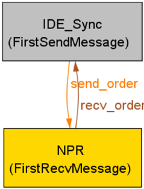
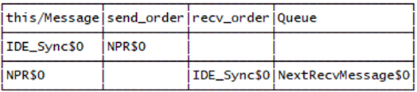
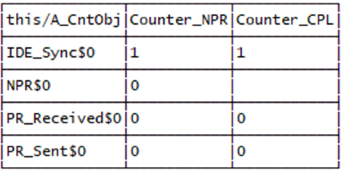

# PCIe Integrity and Data Encryption (IDE) Formal Models

Formal verification models for PCIe IDE transaction ordering protocol security. These models must be run using **Alloy 6**.

This code corresponds to the Intel INT31 blog post titled, "[Security is a Cycle:
How Intel Identified a Vulnerability in PCIe Integrity and Data Encryption, and Produced a Formally Verified Mitigation](https://www.intel.com/content/www/us/en/security/security-practices/blogs/mitigating-pcie-vuln-ide-escort.html)."

## Quick Start

### Prerequisites
- **Alloy 6**: Download from https://alloytools.org/
- **Java 11+**: Required for the Alloy analyzer

### Running Models

**Model Testing:**
```bash
java -jar alloy.jar exec -f PCIe_IDE_transaction_ordering.als
java -jar alloy.jar exec -f PCIe_IDE_transaction_ordering_with_IDE_Escort.als
```

## Model Description

To improve our understanding of the Forbidden IDE Reordering (FIR)
vulnerability, Intel built a formal model of the existing PCIe IDE
transaction ordering protocol in the Alloy modeling language. The
modeling process consisted of five steps:

1.  Establish a notion of temporal state that captures the Transmitter
    and Receiver's Posted Request (PR) counters, the PR counter fields
    of in-flight IDE TLPs, and any errors that have been signaled by the
    Receiver.

2.  Express an abstracted form of the IDE transaction ordering behavior
    in the Alloy modeling language.

3.  Define a high-level state machine that sends and receives IDE TLPs,
    while allowing in-flight TLPs to be arbitrarily reordered.

4.  Craft assertions to check that the Receiver immediately detects
    forbidden IDE reordering and that permitted IDE reordering never
    triggers an error.

We ran our assertions in Step 4 and quickly found counterexamples that
led us to conclude that the existing IDE transaction ordering protocol
cannot detect all instances for forbidden IDE reordering. We then
revisited the model and pursued one additional step:

5.  Extend the model with a mitigation variant and re-check the same
    assertions.

This README describes our experience using Alloy to model this
problem and summarizes our results. The following sections are structured
according to the five steps listed above.

### Establishing Temporal State

The Alloy code shown below defines a class (or "`sig`") of error codes. An
exhaustive tutorial on Alloy syntax and idioms is out of scope for this
paper, but a reader who is familiar with Java syntax may recognize some
of the same keywords, which have a similar meaning in Alloy. A counter
error is raised when either of the Receiver's counters underflows. An
integrity error is raised when TLPs within a sub-stream are reordered.

The `var...in` syntax establishes a set of variables that can change over
time. In this example, Error is a set that can hold a counter error, an
integrity error, both, or neither.

```alloy
abstract sig ErrorCode {}
one sig CounterError extends ErrorCode {}
one sig IntegrityError extends ErrorCode {}
var sig Error in ErrorCode {}
```

The code below defines an abstract class of objects that have a temporal
NPR counter and/or a temporal CPL counter. It then instantiates two
concrete classes PR_Sent and PR_Received; these are prefixes with a one
quantifier to make them singleton instances (because the Transmitter and
Receiver each have one pair of counters). The Message class also inherit
NPR and CPL counters, as NPRs carry NPR counters, CPLs carry CPL
counters, and IDE Sync messages carry both. The Queue is a variable that
the model uses to track the set of TLPs that are in flight between the
sender and receiver.

```alloy
/**
 * The class of stateful objects that may have counter values
 */
abstract sig A_CntObj {
  var Counter_NPR : lone Int,
  var Counter_CPL : lone Int
}

one sig PR_Sent, PR_Received extends A_CntObj {}

abstract sig Message extends A_CntObj {
  send_order : lone Message,
  recv_order : lone Message,
  var Queue : set MessageQueues
}
```

### Modeling Transaction Ordering Behavior

For an NPR, the model copies the transmitter's current NPR counter to the
message and resets the transmitter's counter. When that NPR is received, the
model subtracts the message's counter value from the receiver's NPR counter
and signals a counter error on underflow. CPLs follow the parallel CPL-counter
behavior.

Each rule is encoded as a predicate that evaluates to true when all of the
statements within its bracket are true. Two Alloy features are particularly
useful for expressing state transitions:

- When a variable has a tick mark (`'`) appended to it, this indicates
  the variable's value in the next temporal state. In the example below,
  the next state records a counter error when the subtraction underflows.

- The `++` operator is known as a *relational override*. For example,
  `Counter_NPR` can be thought of as a relation that maps instances of
  `A_CntObj` to integer values. The relational override operator replaces
  selected mappings with the mappings in its right operand. Here, it assigns
  the transmitter's counter to `m` and resets the transmitter's next-state
  counter to 0.

```alloy
pred Send_NPR[m : Message] {
  m in NPR
  Counter_NPR' = Counter_NPR ++ (
    m -> PR_Sent.Counter_NPR
    + PR_Sent -> 0
  )
  Counter_CPL' = Counter_CPL
}

pred Recv_NPR[m : Message] {
  m in NPR
  let New_Counter_NPR =
    minus[PR_Received.Counter_NPR, m.Counter_NPR] {
      Counter_NPR' = Counter_NPR ++ PR_Received -> New_Counter_NPR
      Counter_CPL' = Counter_CPL
      (New_Counter_NPR < 0) implies
        CounterError in Error'
      else
        CounterError not in Error'
    }
}
```

### High-level State Machine

The fact below uses the always temporal operator to establish a behavior
that is true for every state: if no error has been signaled by the
Receiver and there is some message that can eventually be received, then
there must be some message that can be either sent or received in the
current state; otherwise the state machine will *stutter*, meaning that
no variable changes from the current state to the next.

```alloy
/**
 * Think of this as the main loop that non-deterministically selects a
 * message to send or receive (a message can only be received if it
 * has been sent)
 */
fact Behavior_Interleaved {
  always (no Error and some ~Queue[NextRecvMessage]
    implies (some m : Message | Send[m] or Recv[m])
    else Stutter)
}
```

Note that `Recv[m]` can be valid for any m that has been sent by the
Transmitter and not yet received by the Receiver, and that the model
does not enforce any further constraints on the order in which in-flight
messages are received.

### Crafting and Checking Assertions

Alloy successfully found counterexamples that violate the following
assertion:

```alloy
/**
 * Assert that the model permits an ordering exactly when it has not
 * signaled an error.
 */
assert Ordering_Permitted_No_Error {
  always (Ordering_Permitted_At_State <=> no Error)
}
```

The simplest counterexample involves only two messages:





In this example, the IDE Sync is sent before the NPR, but they are
received in the opposite order. The tables show the variables in the
model state after both messages have been sent, and just before the NPR
is received. The model resets the transmitter's counters after sending
an IDE Sync, so the following NPR has a counter value of 0. Receiving
that NPR leaves the receiver's NPR counter unchanged and does not signal
an error, despite the prohibited reordering represented by the model.

### Developing, Modeling, and Checking Mitigation

Intel then extended the model with an enhanced ordering-detection variant.
The variant adds a pair of `Overflow` bits that record whether the next NPR or
CPL carries additional ordering state. The following Alloy code shows how the
`Send_NPR` predicate is extended to transfer and clear the NPR bit:

```alloy
  Overflow' = Overflow ++ (
    m -> (PR_Sent.Overflow & Overflow_NPR) +
    PR_Sent -> (Overflow[PR_Sent] - Overflow_NPR)
  )
```

The assertion in the previous section that failed for the existing protocol, passed
for the proposed protocol enhancement. Intel additionally verified the
following *correctness* property:

```alloy
/** Assert that the receiver can receive all packets in a
 *  permitted ordering. In other words, this assertion checks that
 *  the proposed protocol does not prevent valid reorderings. */
assert Ordering_Permitted_Implies_All_TLPs_Received {
  Ordering_Permitted implies eventually no ~Queue[NextRecvMessage]
}
```

## References

  [1] Intel, "Forbidden IDE Reordering / CVE-2025-9612 / INTEL-SA-01409."
      https://www.intel.com/content/www/us/en/developer/articles/technical/software-security-guidance/advisory-guidance/forbidden-ide-reordering.html